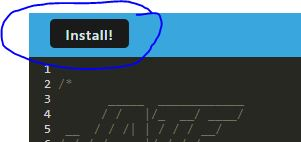
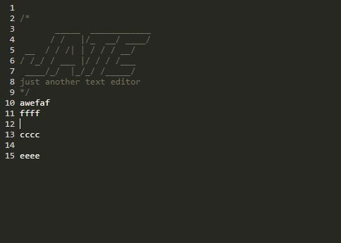

# Online Text Editor

## Description
An online text editor. This is a PWA and can be installed in your browser.

Github Link: https://github.com/lunchtimewhee/online-text-editor
Heroku App Link: https://mysterious-anchorage-23843-14642d4ad6aa.herokuapp.com/

## Table of Contents
 - [Online Text Editor](#online-text-editor)
 - [Description](#description)
 - [Installation Instructions](#installation-instructions)
 - [Usage Information](#usage-information)
 - [License](#license)
 - [Contribution Guidelines](#contribution-guidelines)
 - [Testing Instructions](#testing-instructions)
 - [Questions?](#questions)

## Questions?
- Github: https://github.com/lunchtimewhee 
- Email: anthonyrli1994@gmail.com

## Installation Instructions
1. Go to https://mysterious-anchorage-23843-14642d4ad6aa.herokuapp.com/

## Usage Information
1. Press Install to install this as a PWA (Progressive Web App).

2. You can then edit any part of the text editor and your progress will be saved.

## License

## Testing Instructions
N/A

## Contribution Guidelines
Please reach out to Anthony Li at the below contacts to contribute.

